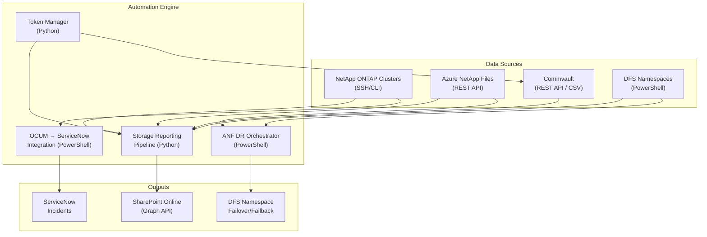

# Infrastructure Automation Toolkit

[](https://python.org)
[](https://github.com/PowerShell/PowerShell)
[](https://azure.microsoft.com)
[](LICENSE)

> A production-grade infrastructure automation toolkit covering **Azure NetApp Files DR orchestration**, **NetApp ONTAP health monitoring**, **Commvault backup API integration**, **ServiceNow ITSM automation**, and a **multi-source storage volume reporting pipeline** — all built for enterprise-scale, hybrid-cloud storage environments.

---

## What This Repo Covers

| Domain | Technology | Language |
|--------|-----------|----------|
| Disaster Recovery Orchestration | Azure NetApp Files, DFS Namespaces | PowerShell |
| Storage Health Monitoring | NetApp ONTAP (SSH/CLI) | Python, Bash |
| Backup API Integration | Commvault REST API | Python |
| ITSM Automation | ServiceNow + NetApp OCUM | PowerShell |
| Volume Reporting Pipeline | ONTAP + ANF + SharePoint | Python |
| CI/CD Pipelines | Azure DevOps | YAML |

---

## Architecture Overview



---

## Modules

### [`anf-dr/`](./anf-dr) — Azure NetApp Files DR Automation
Fully automated **failover and failback orchestration** for Azure NetApp Files cross-region replication paired with DFS Namespace management.

**Key capabilities:**
- One-command failover: breaks ANF replication, enables DR DFS targets
- One-command failback: resyncs ANF replication, restores source DFS targets
- JSON state file tracking for multi-step orchestration
- DPAPI credential management (no plaintext passwords)
- Real-time status dashboard with color-coded health indicators
- Auto-detect QoS type (Auto vs Manual) for volume provisioning
- ARM-style JSON templates for capacity pool and volume definitions

```powershell
# Check DR status across all environments
.\Get-DR-Status.ps1

# Execute failover (Production)
.\Invoke-DR-Failover.ps1 -Environment Production

# Execute failback when ready
.\Invoke-DR-Failback.ps1 -Environment Production -Force
```

---

### [`commvault/`](./commvault) — Commvault Backup REST API
Python-based **token lifecycle management and subclient configuration** for Commvault backup automation.

**Key capabilities:**
- Automatic token renewal with expiry buffer and persistent JSON caching
- Dynamic datalake backup exclusion generation (quarterly history tables)
- REST API GET/POST with timeout, retry, and structured error handling
- Token health monitoring with threshold-based alerts

```python
from token_manager import TokenManager

tm = TokenManager()
token = tm.get_valid_token()   # auto-renews if within expiry buffer
```

---

### [`snow-netapp-integration/`](./snow-netapp-integration) — OCUM → ServiceNow Integration
Event-driven **ITSM automation** that converts NetApp OCUM alerts directly into ServiceNow incidents with intelligent urgency/impact mapping.

**Key capabilities:**
- Automatic urgency/impact scoring from OCUM event severity
- Configurable suppression rules (maintenance windows, non-actionable events)
- Idempotent: obsolete events auto-close their linked incidents
- Per-event log files for full audit trail
- Supports Production, Dev, and Test ServiceNow environments

```
OCUM Event → Master.ps1 → Evaluate Suppression → Map Severity
    → Create/Close ServiceNow Incident → Log to audit file
```

---

### [`storage-reporting/`](./storage-reporting) — Multi-Source Volume Reporting Pipeline
Daily Python pipeline that aggregates **storage inventory from all platforms** into a unified SharePoint-hosted dataset.

**Key capabilities:**
- Parallel collectors: ONTAP (SSH/Paramiko), Azure NetApp Files (REST), Commvault (CSV), DFS (PowerShell)
- Idempotent daily append — safe to rerun without duplicates
- Intelligent backup coverage rules (DP/LS volumes, DR volumes auto-excluded)
- SharePoint Online upload via Microsoft Graph API
- `--dry-run` flag for safe testing
- Configurable via environment variables (no hardcoded secrets)

```python
# Full pipeline run
python volume_reporting_main.py

# Dry run (no SharePoint upload)
python volume_reporting_main.py --dry-run

# Partial run — skip slow collectors
python volume_reporting_main.py --skip-ontap --skip-anf
```

---

### [`intersight-snw-integration/`](./intersight-snw-integration) — Cisco Intersight → ServiceNow
Architecture and integration patterns for routing **Cisco Intersight hardware alerts** into ServiceNow incidents via REST API.

---

### [`pipelines/`](./pipelines) — Azure DevOps CI/CD
Azure DevOps pipeline definitions for automated deployment of all automation scripts to NFS-hosted execution environments.

| Pipeline | Trigger | Purpose |
|----------|---------|---------|
| `storage-volume-reporting-pipeline.yml` | Daily 06:00 UTC | Run volume reporting pipeline |
| `commvault-automation-pipeline.yml` | `commvault/*` push | Deploy Commvault scripts |
| `storage-automation-pipeline.yml` | `Automation/*` push | Deploy storage scripts |
| `netapp-ocum-pipeline.yml` | `NAS/OCUM/*` push | Deploy OCUM scripts |

---

## Technology Stack

**Languages:** Python 3.10+, PowerShell 7.x, Bash  
**Azure:** Azure NetApp Files (Az.NetAppFiles), Azure AD, Microsoft Graph API, Azure DevOps  
**NetApp:** ONTAP 9.x SSH/CLI, OCUM/AIQUM REST API, SnapMirror, FPolicy  
**Backup:** Commvault v11+ REST API  
**ITSM:** ServiceNow REST API (incident create/close/update)  
**Python libs:** `paramiko`, `requests`, `pandas`, `azure-identity`  
**PowerShell modules:** `Az.NetAppFiles`, `DFSN`, `ActiveDirectory`, `Pester`

---

## Design Principles

- **No hardcoded secrets** — all credentials via environment variables, DPAPI, or encrypted key files
- **Dry-run by default** — state-changing operations require explicit `--execute` or `-Force` flags
- **Idempotent** — safe to rerun; no duplicate records, no duplicate incidents
- **Structured logging** — every operation logs with timestamp, level (INFO/WARN/ERROR/SUCCESS), and operation context
- **Modular collectors** — each data source is an independent module; easy to add/skip individual sources

---

## Getting Started

### Python (storage-reporting, commvault)
```bash
pip install -r storage-reporting/requirements.txt

# Required environment variables
export AZURE_TENANT_ID="..."
export AZURE_CLIENT_ID="..."
export AZURE_CLIENT_SECRET="..."
export SP_TENANT_ID="..."
export SP_CLIENT_ID="..."
export SP_CLIENT_SECRET="..."
```

### PowerShell (anf-dr)
```powershell
# Required modules
Install-Module Az.NetAppFiles -Scope CurrentUser
Install-Module Az -Scope CurrentUser

# One-time credential setup (DPAPI encrypted)
Get-Credential | Export-Clixml -Path "$env:USERPROFILE\.admin_cred.xml"
```

---

## Author

**Sritam Mohanty**  
Infrastructure Automation Engineer | Storage & Cloud  
[LinkedIn](https://linkedin.com/in/sritam-mohanty) · [GitHub](https://github.com/sritam35)
