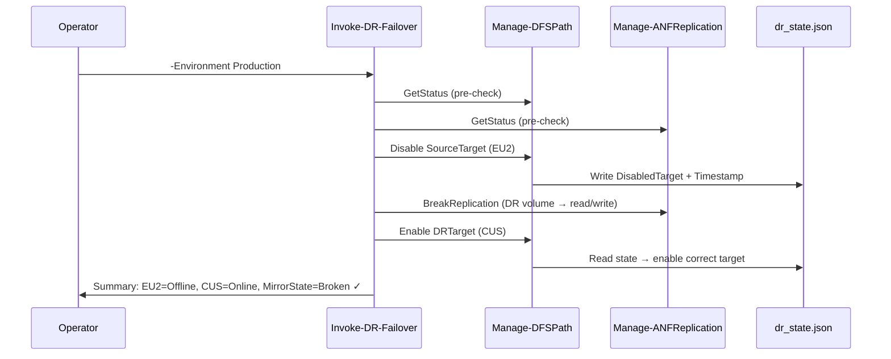

# ANF DR Automation

[](https://github.com/PowerShell/PowerShell)
[](https://azure.microsoft.com/en-us/products/netapp)

Automated **Disaster Recovery orchestration** for Azure NetApp Files (ANF) cross-region replication, paired with Windows DFS Namespace target management. Enables one-command failover and failback for NFS/SMB workloads running on ANF volumes.

---

## Architecture



---

## Scripts

| Script | Purpose | Safe to run? |
|--------|---------|-------------|
| `Get-DR-Status.ps1` | Real-time status dashboard | ✅ Read-only |
| `Invoke-DR-Failover.ps1` | Phase 1: failover to DR region | ⚠️ Destructive if unexpected |
| `Invoke-DR-Failback.ps1` | Phase 2: failback to source region | ⚠️ Discards DR data |
| `Manage-ANFReplication.ps1` | Break / resync / status ANF replication | Core module |
| `Manage-DFSPath.ps1` | Enable / disable DFS folder targets | Core module |
| `Create-ANFVolumes.ps1` | Provision source + DataProtection volumes | Provisioning |
| `Establish-ANFReplication.ps1` | Authorize + establish replication | Provisioning |

---

## Usage

```powershell
# ── Check current status (safe, read-only) ──────────────────────────────────
.\Get-DR-Status.ps1
.\Get-DR-Status.ps1 -Environment Test

# ── Failover to DR region ────────────────────────────────────────────────────
.\Invoke-DR-Failover.ps1 -Environment Production
.\Invoke-DR-Failover.ps1 -Environment Test -Force   # skip confirmation prompts

# ── Failback to source region ────────────────────────────────────────────────
.\Invoke-DR-Failback.ps1 -Environment Production
# WARNING: ResyncReplication discards all writes to DR volume during test period

# ── Operate individual components ────────────────────────────────────────────
.\Manage-ANFReplication.ps1 -Action GetStatus -Environment Production
.\Manage-ANFReplication.ps1 -Action BreakReplication -Environment Production
.\Manage-ANFReplication.ps1 -Action ResyncReplication -Environment Production -Force

.\Manage-DFSPath.ps1 -Action GetStatus -Environment Production
.\Manage-DFSPath.ps1 -Action Disable -Environment Production
.\Manage-DFSPath.ps1 -Action Enable -Environment Production
```

---

## Configuration

All DR configuration is driven by a single CSV — no hardcoded paths in scripts:

**`ANF_DR_Config.csv`**
```
Environment,DFSFolderPath,SourceTarget,DRTarget,VolumeName
Production,\\domain\share\folder,\\source-anf\share,\\dr-anf\share,volume-name
Test,\\domain\share\folder-test,\\source-anf\test,\\dr-anf\test,volume-name-test
```

**State tracking (`dr_state_production.json`)**  
Written automatically during `Disable` operations, read during `Enable` — no manual editing needed:
```json
{
  "DisabledTarget": "\\\\source-anf.domain\\share",
  "Timestamp": "2026-03-21T08:58:00.1308404-04:00"
}
```

---

## Key Design Decisions

**1. State file for phase detection**  
Failover and failback are two separate operations. The state file records _which_ DFS target was disabled, so the `Enable` action always knows which target to activate next — eliminating operator error.

**2. Local process impersonation (WinRM workaround)**  
DFS admin operations require elevated credentials. When WinRM/DCOM are blocked for the service account, the scripts write an inner script to a temp file and launch it via `Start-Process -Credential`, which authenticates via native RPC — identical to the DFS Management GUI.

**3. Auto QoS detection**  
Volume provisioning automatically detects whether the capacity pool uses Auto or Manual QoS and conditionally includes `ThroughputMibps` — preventing provisioning failures on Auto QoS pools.

**4. MirrorState interpretation**  
`MirrorState=Broken` with `Healthy=True` is the **expected, correct state** during an active DR scenario. Scripts explicitly communicate this to avoid operator confusion.

---

## Prerequisites

```powershell
Install-Module Az.NetAppFiles -Scope CurrentUser
Install-Module Az              -Scope CurrentUser

# One-time admin credential setup (Windows DPAPI encrypted — machine/user bound)
Get-Credential -UserName 'domain\admin-account' |
    Export-Clixml -Path "$env:USERPROFILE\.admin_cred.xml"
```

---

## ANF Replication States Reference

| MirrorState | RelationshipStatus | Meaning |
|-------------|-------------------|---------|
| `Mirrored` | `Idle` | Normal — replication healthy |
| `Broken` | `Idle` | **DR Active** — volume is read/write in DR region |
| `Resyncing` | `Transferring` | Failback in progress |
| `Uninitialized` | — | Replication not yet established |
