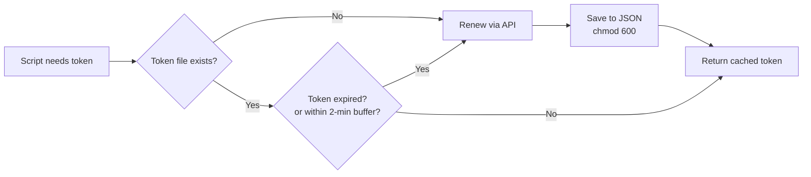

# Commvault Backup Automation

[](https://python.org)
[](https://api.commvault.com)

Python modules for **Commvault backup REST API automation** — covering token lifecycle management, subclient configuration, and dynamic datalake backup exclusion generation.

---

## Modules

| File | Purpose |
|------|---------|
| `token_manager.py` | Token acquisition, caching, expiry detection, auto-renewal |
| `check_token_health.py` | Pre-operation token health check with threshold alerts |
| `renew_token.py` | Proactive scheduled token renewal (run every 7 days) |
| `commvault_get_api.py` | Authenticated GET requests with error handling |
| `commvault_post_api.py` | Subclient configuration update via POST |
| `dynamic_datalakebkp_exclusions.py` | Auto-generate quarterly history table exclusions |

---

## Token Lifecycle



**Token file** is stored with `chmod 0o600` — readable only by the service account. Never stored in environment variables or code.

---

## Usage

```python
from token_manager import TokenManager

# Get a valid token (auto-renews if expired)
tm = TokenManager()
token = tm.get_valid_token()

# Check health before monthly operations
python check_token_health.py
# Output:
# [2026-06-01] Token age: 5 days  ✅ GOOD — token valid, renewal not urgent

# Force renewal
python renew_token.py
```

---

## Dynamic Datalake Exclusions

The `dynamic_datalakebkp_exclusions.py` script automatically generates Commvault subclient exclusion paths for **all historical quarters except the current one** — ensuring only active-quarter data is backed up, reducing backup storage costs significantly.

```python
# Auto-generates paths like:
# /raw/gdm-security-master/2024_q1
# /raw/gdm-security-master/2024_q2
# /raw/gdm-security-master/2024_q3
# (current quarter is NOT excluded — it stays in backup)

generate_all_quarters(start_year=2024)
# Returns: ['2024_q1', '2024_q2', '2024_q3', '2025_q1', ...]
```

**Schedule:** Run on the 1st of each month to catch quarter transitions automatically.

---

## Error Handling

```python
try:
    response = requests.post(url, headers=headers, json=payload,
                             timeout=30, verify=False)
    response.raise_for_status()
except requests.exceptions.HTTPError as e:
    print(f"API error {response.status_code}: {response.text}")
except requests.exceptions.Timeout:
    print("Request timed out after 30s")
except requests.exceptions.RequestException as e:
    print(f"Connection failed: {e}")
```

---

## Token Health Thresholds

| Token Age | Status | Action |
|-----------|--------|--------|
| < 7 days | ✅ EXCELLENT | No action needed |
| 7–10 days | ✅ GOOD | Renewal not urgent |
| 10–14 days | ⚠️ CAUTION | Renew soon |
| > 14 days | ❌ CRITICAL | Token expired — renew immediately |

---

## Security Design

- Token stored as JSON with `chmod 0o600` (owner read/write only)
- 2-minute expiry buffer prevents mid-operation token failures
- No credentials in source code — server URL and token path configured via constants
- `verify=False` used only on internal Commvault server (self-signed cert); not for public endpoints
