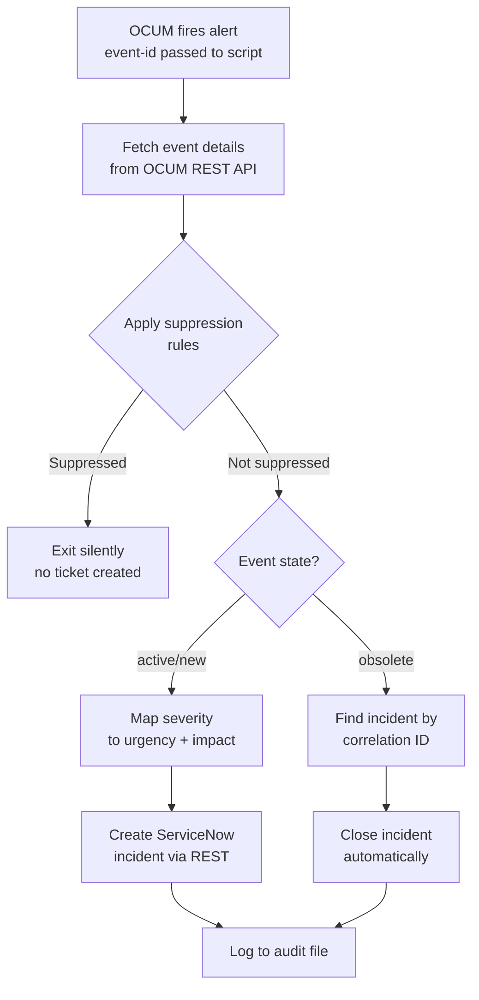

# NetApp OCUM → ServiceNow Integration

[](https://github.com/PowerShell/PowerShell)
[](https://developer.servicenow.com)
[](https://www.netapp.com)

Event-driven **ITSM automation** that converts NetApp OnCommand Unified Manager (OCUM/AIQUM) storage alerts directly into ServiceNow incidents — with intelligent severity mapping, configurable suppression rules, and automatic incident closure.

---

## How It Works



---

## Files

| File | Purpose |
|------|---------|
| `Master.ps1` | Main orchestrator — receives OCUM event ID, drives full workflow |
| `OCUM-getevent.ps1` | Query OCUM REST API for event details by ID |
| `SNWNewIncidentModule.ps1` | Create ServiceNow incident via REST API |
| `SNWCloseIncidentModule.ps1` | Close ServiceNow incident by correlation ID |
| `append-message.ps1` | Timestamped log appender (INFO / WARN / ERROR) |
| `maintenance.txt` | List of hostnames/resources to suppress during maintenance windows |

---

## Urgency / Impact Mapping

OCUM event severity is automatically translated to ServiceNow urgency and impact:

| OCUM Severity | OCUM Impact Level | ServiceNow Urgency | ServiceNow Impact |
|--------------|------------------|-------------------|------------------|
| `critical` | `incident` | 1 (High) | 1 (High) |
| `error` | `risk` | 2 (Medium) | 2 (Medium) |
| `warning` | `event` | 2 (Medium) | 3 (Low) |

**Override rules** (specific event names take priority):

| Event Name | Urgency | Impact | Reason |
|------------|---------|--------|--------|
| Space Full | 1 | 1 | Immediate data loss risk |
| LIF Status Down | 1 | 1 | Network connectivity loss |
| Cluster Not Reachable | 1 | 1 | Total storage outage |
| Inodes Full | 1 | 1 | Filesystem write failure |
| Some Failed Disks | 2 | 3 | Degraded, not failed |

---

## Suppression Rules

Some OCUM events are informational or expected — these are suppressed to reduce noise:

```powershell
# 1. Volume Offline on Software-Defined Workload clusters → expected, suppress
# 2. Space Full / Nearly Full on backup volumes → managed separately, suppress
# 3. Volume Growth Rate Abnormal on specific clusters → except known critical volumes
# 4. Any event from a host listed in maintenance.txt → suppress during maintenance windows
```

**Maintenance suppression:** Add the OCUM `event-source-name` (hostname or volume path) to `maintenance.txt` — one entry per line. Events from those sources are silently dropped for the duration of the maintenance window.

---

## Incident Creation Parameters

```
Short Description:  "CRITICAL: Space Full vol_name_here - 12345"
                     └ format: {Severity}: {EventName} {SourceName} - {EventId}
Assignment Group:   Automation Group
Category:           Hardware
Subcategory:        NAS - Storage
Correlation ID:     OCUM event-id (used for deduplication and closure)
Alert Source:       OCUM
```

---

## Automatic Incident Closure

When OCUM marks an event as `obsolete` (the condition resolved itself), the script automatically finds and closes the corresponding ServiceNow incident using the OCUM event ID as the correlation key:

```
Event state = obsolete
    → SNWCloseIncidentModule.ps1 -CorrelationId {event-id}
    → Exit code 0 = closed
    → Exit code 1 = no open incident found (already closed or never created)
```

---

## Audit Logging

Every event generates its own log file:
```
Logs\2026-06-24-Master-Event12345.log

[2026-06-24 09:15:32][INFO]  Received event ID: 12345
[2026-06-24 09:15:33][INFO]  Event: Space Full | Severity: critical | Source: vol_prod_01
[2026-06-24 09:15:33][INFO]  Mapped urgency=1, impact=1 (Space Full override)
[2026-06-24 09:15:34][INFO]  Incident created: INC0045231
```

---

## Environments

Supports three ServiceNow environments via credential sets:
- **Production** — live incidents routed to on-call team
- **Test** — QA validation environment
- **Dev** — development/testing only
