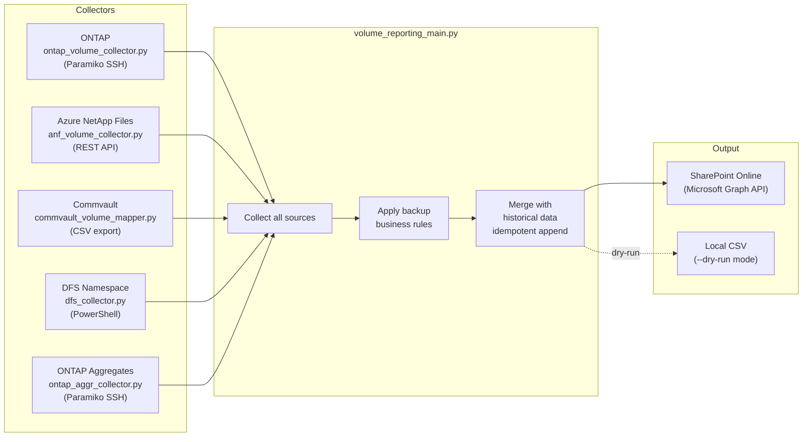

# Storage Volume Reporting Pipeline

[](https://python.org)
[](https://learn.microsoft.com/en-us/graph/overview)
[](https://www.netapp.com)

A daily Python pipeline that collects **storage volume inventory from all platforms** — NetApp ONTAP clusters (SSH), Azure NetApp Files (REST API), Commvault backup status (CSV), and DFS namespace mappings — then merges the data and publishes it to **SharePoint Online** via Microsoft Graph API.

---

## Data Flow



---

## Output Datasets

| File | Strategy | Columns |
|------|----------|---------|
| `volume_snapshots.csv` | Daily append | platform, cluster, svm, volume_name, size_gb, used_gb, pct_used, backup_configured |
| `backup_status.csv` | Daily overwrite | cluster, svm, volume_name, backup_configured, last_backup_date, subclient_name |
| `dfs_mapping.csv` | Daily overwrite | dfs_path, target_path, svm, volume_name, state |
| `aggr_snapshots.csv` | Daily append | cluster, node, aggr_name, size_gb, used_gb, pct_used, raid_status |

---

## Usage

```bash
# Full pipeline run (collects everything, uploads to SharePoint)
python volume_reporting_main.py

# Dry run — collect data, write CSVs locally, skip SharePoint upload
python volume_reporting_main.py --dry-run

# Skip individual collectors (useful during partial outages or testing)
python volume_reporting_main.py --skip-ontap
python volume_reporting_main.py --skip-anf
python volume_reporting_main.py --skip-commvault
python volume_reporting_main.py --skip-dfs
python volume_reporting_main.py --skip-aggr
python volume_reporting_main.py --skip-sharepoint

# Example: collect everything but don't upload
python volume_reporting_main.py --skip-sharepoint
```

---

## Configuration

All configuration via environment variables — zero secrets in code:

```bash
# NetApp ONTAP SSH
export ONTAP_SSH_USER="svc_account"
export ONTAP_SSH_KEY_PATH="/path/to/ssh/id_rsa"
export ONTAP_CLUSTERS_FILE="/path/to/clusters.conf"

# Azure NetApp Files (service principal)
export AZURE_TENANT_ID="..."
export AZURE_CLIENT_ID="..."
export AZURE_CLIENT_SECRET="..."
export ANF_SUBSCRIPTION_ID="..."

# SharePoint Online (service principal)
export SP_TENANT_ID="..."
export SP_CLIENT_ID="..."
export SP_CLIENT_SECRET="..."
export SHAREPOINT_HOSTNAME="yourorg.sharepoint.com"
export SHAREPOINT_SITE_PATH="/sites/your-team-site"
export SHAREPOINT_FOLDER="Storage-Reporting/volume-data"

# Commvault CSV exports directory
export CV_REPORT_DIR="/path/to/commvault/reports"
```

**`clusters.conf`** — one hostname per line, `#` for comments:
```
# Production clusters
cluster-01.domain.com
cluster-02.domain.com
# cluster-03.domain.com  ← commented out = skipped
```

---

## Backup Business Rules

The pipeline applies intelligent override rules for the `backup_configured` field:

```python
# ONTAP DP/LS volumes (replicas) → not directly backed up → "NA"
if platform == 'ONTAP' and volume_type in ('DP', 'LS'):
    backup_configured = 'NA'

# ANF DR region volumes → backed up at source, not DR → "NA"
if platform == 'ANF' and azure_region == 'dr-region':
    backup_configured = 'NA'

# System/test/infra volumes → excluded by naming pattern → "NA"
skip_patterns = ['tst', 'sqlbkp', 'root', 'esx', 'vault', 'test']
if any(p in volume_name for p in skip_patterns):
    backup_configured = 'NA'
```

---

## Idempotency

The pipeline is safe to rerun multiple times per day:

```python
# Before appending today's data, remove any existing rows for today
today = date.today().isoformat()
existing_history = [r for r in all_rows if r['snapshot_date'] != today]
final_rows = existing_history + todays_new_rows
```

This ensures no duplicate rows accumulate even if the pipeline reruns due to failures or retries.

---

## SharePoint Upload

Files are uploaded directly to SharePoint document libraries using **Microsoft Graph API**:

```python
headers = {
    "Authorization": f"Bearer {access_token}",
    "Content-Type": "text/csv"
}
url = f"https://graph.microsoft.com/v1.0/sites/{site_id}/drive/items/{folder_id}:/{filename}:/content"
requests.put(url, headers=headers, data=csv_content.encode('utf-8'))
```

---

## Requirements

```
paramiko>=3.0.0
requests>=2.28.0
pandas>=2.0.0
urllib3>=2.0.0
```

```bash
pip install -r requirements.txt
```
